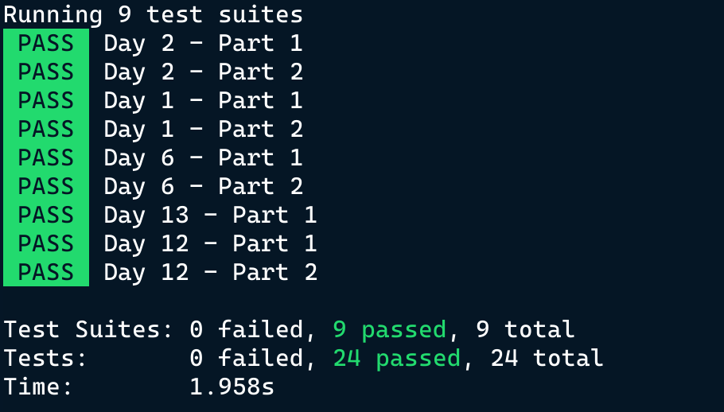

# Advent of Code 2019

Trying some solutions for ReasonML on the Native side. Solutions are mostly transferable from the BuckleScript implementations due to [Tablecloth](https://github.com/darklang/tablecloth).

## Advent of Code 2019 Story

Santa has become stranded at the edge of the Solar System while delivering presents to other planets! To accurately calculate his position in space, safely align his warp drive, and return to Earth in time to save Christmas, he needs you to bring him measurements from fifty stars.

Collect stars by solving puzzles. Two puzzles will be made available on each day in the Advent calendar; the second puzzle is unlocked when you complete the first. Each puzzle grants one star. Good luck!

## Days

| Day                                                                                                                                | #1  |  #2 |
| ---------------------------------------------------------------------------------------------------------------------------------- | --- | --- |
| [Day 1: The Tyranny of the Rocket Equation](https://github.com/believer/advent-of-code/blob/master/advent-of-native/lib/DayOne.re) | 🌟  | 🌟  |
| [Day 2: 1202 Program Alarm](https://github.com/believer/advent-of-code/blob/master/advent-of-native/lib/DayTwo.re)                 | 🌟  | 🌟  |
| [Day 6: Universal Orbit Map](https://github.com/believer/advent-of-code/blob/master/advent-of-native/lib/Day6.re)                  | 🌟  | 🌟  |
| [Day 12: The N-Body Problem](https://github.com/believer/advent-of-code/blob/master/advent-of-native/lib/Day12.re)                 | 🌟  | 🌟  |
| [Day 13: Care Package](https://github.com/believer/advent-of-code/blob/master/advent-of-native/lib/Day13.re)                       | 🌟  |     |

## Performance

I haven't been able to add a real benchmarking framework yet. But I have tests using [Rely](https://reason-native.com/docs/rely/) which runs the entire test suite in **1.958 seconds** at the moment. Most of the time is for Day 12 part 2.

